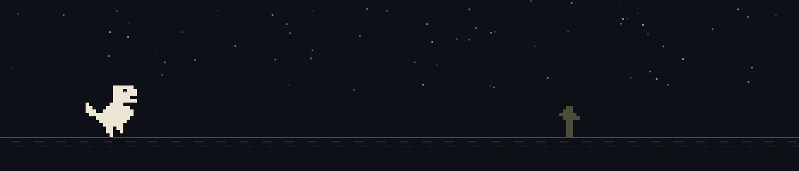

  
  

  

    𝙰𝚕𝚠𝚊𝚢𝚜 𝚘𝚙𝚎𝚗 𝚝𝚘 𝚌𝚘𝚗𝚝𝚛𝚒𝚋𝚞𝚝𝚒𝚗𝚐 𝚝𝚘 𝚘𝚙𝚎𝚗-𝚜𝚘𝚞𝚛𝚌𝚎 𝚙𝚛𝚘𝚓𝚎𝚌𝚝𝚜 𝚊𝚗𝚍 𝚌𝚘𝚕𝚕𝚊𝚋𝚘𝚛𝚊𝚝𝚒𝚗𝚐 𝚘𝚗 𝚒𝚗𝚗𝚘𝚟𝚊𝚝𝚒𝚟𝚎 𝚜𝚘𝚏𝚝𝚠𝚊𝚛𝚎 𝚒𝚍𝚎𝚊𝚜.

 
 

<h2 align="center">ＴＥＣ　ＳＴＡＣＫ</h2>
<h4 align="center">ℙℝ𝕆𝔾ℝ𝔸𝕄𝕀ℕ𝔾 𝕃𝔸ℕ𝔾</h4>

  
  
  
  
  
  
  

<h4 align="center">𝔽ℝ𝕆ℕ𝕋𝔼ℕ𝔻</h4>

  
  
  

<h4 align="center">𝔹𝔸ℂ𝕂𝔼ℕ𝔻,𝔻𝔸𝕋𝔸𝔹𝔸𝕊𝔼 & ℂ𝕃𝕆𝕌𝔻</h4>

  
  
  
  

  

<h4 align="center">𝔸𝕀 𝕋𝕆𝕆𝕃𝕊</h4>

  
  
  

<h4 align="center">𝔻𝔼𝕍 𝕋𝕆𝕆𝕃𝕊 & 𝕀𝔻𝔼𝕊</h4>

  
  
  
  
  

  
  
  
  

 
 
<!DOCTYPE html>
<html lang="en">
<head>
    <meta charset="UTF-8">
    <meta name="viewport" content="width=device-width, initial-scale=1.0">

        
 <!DOCTYPE html>
<html lang="en">
<head>
    <meta charset="UTF-8">
    <meta name="viewport" content="width=device-width, initial-scale=1.0">

    <title>Skills</title>

    <!-- Chart.js -->
    

    
</head>

<body>

<section class="skills-section">

    

        <!-- =====================================================
             BOX 1 - DEVELOPMENT SKILLS
        ====================================================== -->

        

            

                Skill Radar
            

            

                Development
            

            

                <canvas id="developmentChart"></canvas>
            

        

        <!-- =====================================================
             BOX 2 - GITHUB LANGUAGE MIX
        ====================================================== -->

        

            

                TharukiJ · GitHub Language Mix
            

            

                GitHub
            

            

                <canvas id="githubChart"></canvas>

                

                    Loading GitHub data...
                

                

                

            

        

        <!-- =====================================================
             BOX 3 - QA SKILLS
        ====================================================== -->

        

            

                QA Skill Radar
            

            

                Software Testing
            

            

                <canvas id="qaChart"></canvas>
            

        

    

    

</section>

</body>
</html>          

